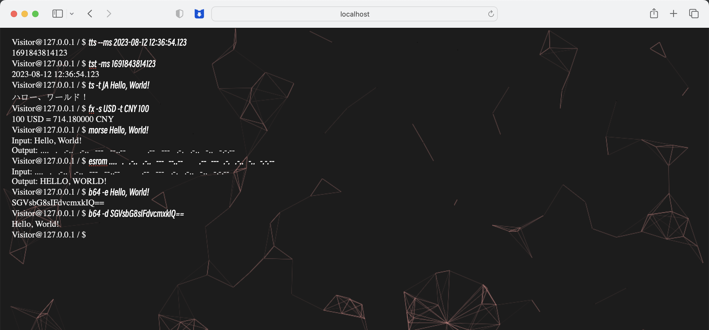
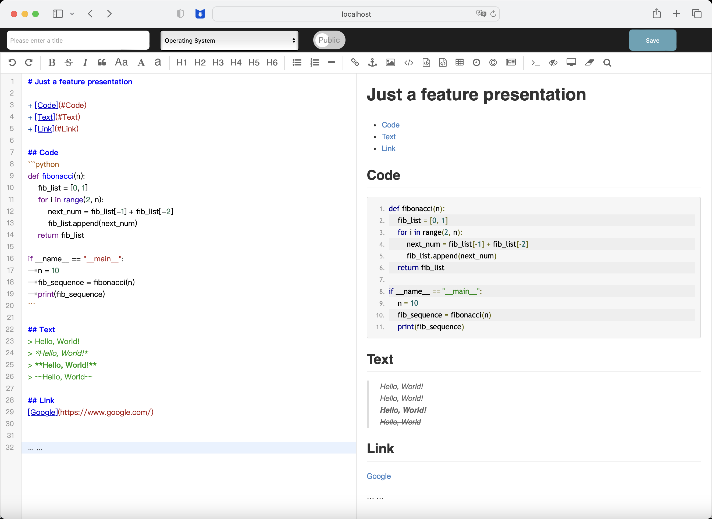
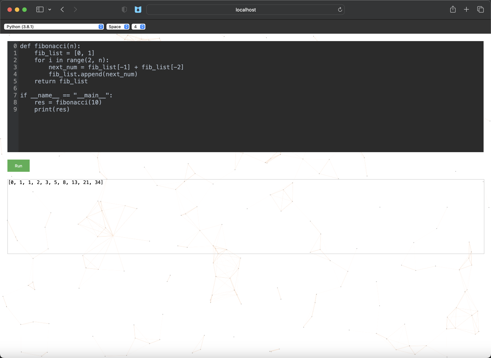

*[English](README-EN.md) ∙ [简体中文](README.md)*

[](https://github.com/<USERNAME>/<REPO_NAME>/graphs/contributors)


# 目录
* [Project Description](#project-description)
* [Quick Start](#quick-start)
* [Instructions for use](#instructions-for-use)
* [Project Catalog Structure](#project-catalog-structure)
* [Author](#author)
* [Contribute](#contribute)
* [Update Log and Plans](#update-log-and-plans)
* [Special Thanks](#special-thanks)
* [Open Source Protocol](#open-source-protocol)

## Project Description
A Geek-inspired smorgasbord of sites

## Quick Start
Step 1: Cloning the project code locally

    git clone https://github.com/N0V1C3-R/GeekHome.git

Step 2: Go to the project directory

    cd /GeekHome

Step 3: Configure the /config/.env file to uncomment accordingly and set the environment variables

Step 4: Modify the variable configuration in the docker-compose.yml file
+ If the system architecture is ARM architecture, MYSQL_IMAGE=arm64v8/mysql:8.0
+ If the system architecture is x86, MYSQL_IMAGE=mysql:8.0

Step 5: Build the project using the docker-compose command

    docker-compose build
    docker-compose up

Step 6: Click to [register](http://localhost:5466/register "link") a super administrator user for backend management.

## Instructions for use
+ Command Service Description
>
> `help` View help for all commands
>
> `man <COMMAND>` View a detailed description of the specified command
>
> `clear` Clear the screen
>
> `trans [-t TARGET_LANG] <TEXT>` Translation commands, -t is optional, used to specify the target language, the source language is automatically detected, and the target language defaults to *English (American)*.
>
> `fx [-s SOURCE_CURRENCY] [-t TARGET_CURRENCY] <AMOUNT>` Exchange rate conversion commands, -s and -t are optional, used to specify the source and target currencies respectively, the default values are CNY and USD, respectively, and the data source *[China Foreign Exchange Trade System](https://www.chinamoney.com.cn/ "link")*
>
> `morse <TEXT>` Morse code coding command
>
> `esrom <TEXT>` Morse code decoding commands
>
> `b64 [-d | -e] <TEXT>` Base64 encoding and decoding commands, use the -d parameter for Base64 decoding of text, use -e for Base64 encoding of text, the default is Base64 encoding
>
> `bc [-sS SOURCE_BASE] [-tT TARGET_BASE] <VALUE>` Binary conversion command, The -s and -t parameters are used to specify the source and target binaries, respectively
> 
> `tts [--ms] [--tz TIMEZONE] [TIME]` Time to timestamp command, --ms specifies that the time conversion precision is milliseconds, the default is seconds, the --tz parameter specifies the time zone
>
> `tst [--ms] [--tz TIMEZONE] [TIMESTAMP]` Timestamp to time command, --ms specifies that the time conversion precision is milliseconds, the default is seconds, the --tz parameter specifies the time zone
>
> `genpwd [-lunsLUNS] [PASSWORD_LENGTH]` Password generation Command, -l, u, n and s are used to specify whether the password needs to contain lowercase letters, uppercase letters, numbers and special characters, the default all contain, password_length parameter is used to specify the length of the password, the default 12 characters
> 
> `codev [LANG] [-t | -s] [INDENT_UNIT]` Enter the codev online IDE page command, LANG to specify the development language (default Python3), -t and -s to specify the indentation type (default Space indentation), INDENT_UNIT to specify the indentation length (default indentation 4 characters)
>
> `rename <NEW_USERNAME>` Modify the username, the default username is the e-mail address used for creation (used in the login state)
>
> `adk <SERVICE_NAME> <API_KEY>` Adding a private API Key to the service (to be used while logged in)
>
> `fdk <SERVICE_NAME>` Find the private API Key set by a service (used while logged in)
>
> `upk <SERVICE_NAME>` Updating the private API Key set by a service (used in the logged-in state)
>
> `ban <SERVICE_NAME>` Disable private API Key for a service (used in login state)
>
> `open [-r | -n] <URL>` Open a link command, -r and -n for the current tab jump and new tab open, the default for the new tab open
>
> `login` Command to jump to the login page
>
> `register` Command to jump to the registration page
>
> `exit` Logout command, use to log out when you are logged in, or close the window when you are not logged in.
>
> `google [CONTENT]` Google search command, without the CONTENT parameter will open in a new tab *[Google](https://www.google.com/ "link")* , with CONTENT will directly use Google to search for content and open in a new tab (it is recommended to use this command in network environments that support Google's use of the command)
>
> `bing [CONTENT]` Bing search command, when used without the CONTENT parameter will open in a new tab *[Bing](https://www.bing.com/ "link")* , with the CONTENT will directly use Bing to search for content and open in a new tab
>
> `github [CONTENT]` GitHub search command, when used without the CONTENT parameter it opens in a new tab *[GitHub](https://github.com/ "link")* , with CONTENT it searches for content directly using GitHub and opens in a new tab
>
> `blog [-a AUTHOR] [-t TITLE]` Go to the blog list page, carry parameters -a and -t for searching specific users and titles with keywords, respectively
>
> 
>

+ Blog Feature Description

**Note**: **Please do not post anything that involves political, illegal, or sensitive topics**
> Support Markdown syntax writing, support modify published articles, support anonymous posting
>
> 
>
+ CodeV Feature Description
>
> An online code editing and execution function, supported by *[Judge0](https://judge0.com/ "link")* open source API, suitable for ad-hoc inspired implementations, ad-hoc code editing needs
>
> 
>

## Project Catalog Structure
```
.
├── Dockerfile
├── README-en.md
├── README.md
├── config --------------------------- // Project configuration folder, modify the .env configuration file when building the service
├── docker-compose.yml
├── go.mod
├── go.sum
├── init.sql
└── src ------------------------------ // Project Source Code Catalog
    ├── crontab_job ------------------ // Timing script task directory, edit the timing script in this directory
    ├── database --------------------- // MySQL Services Related Code Catalog
    │        ├── dao ----------------- // DAO layer code catalog, each dao corresponds to a model, used to encapsulate the database operation code
    │        └── model --------------- // Model catalog, each model corresponds to a data table
    ├── main
    │    └── main.go ----------------- // Main function entry
    ├── redis ------------------------ // Redis Service Related Code Catalog
    ├── server ----------------------- // Service Interface Code Catalog
    │      ├── command_server -------- // Command Service Code Catalog
    │      └── middleware ------------ // Middleware Code Catalog
    ├── templates -------------------- // Front-end Code Catalog
    │         ├── css ---------------- // CSS file directory
    │         ├── fonts -------------- // Font File Catalog
    │         ├── html --------------- // HTML file directory
    │         ├── js ----------------- // JavaScript file directory
    │         └── lib ---------------- // Third-Party Front-End Code Catalog
    │             ├── codemirror
    │             └── editormd
    └── utils ------------------------ // Tool Unit Code Catalog
```

## Author

The [GeekHome](https://github.com/N0V1C3-R/GeekHome "link") project was created and is maintained by *[Max Lee](https://github.com/N0V1C3-R)*

## Contribute

Join the project development can be cut from the master branch to a new development branch for development, the location of the code files, please see the directory structure description, when the development of new features can be completed to launch a PR to release-test branch, the author of the test will be merged into the master branch for the project after the test is passed to deploy and release (please follow the commit specification)

## Update Log and Plans

You can check the project update status and update plan in *[Update Log and Plans](CHANGELOG-EN.md)*.

## Special thanks
Project inspired by *[YuIndex](https://github.com/liyupi/yuindex)*

Thanks to *[DeepL](https://www.deepl.com/ "link")* for translation API support, and *[Judge0](https://judge0.com/ "link")* for open source online IDE feature support!

## Open Source Protocol
