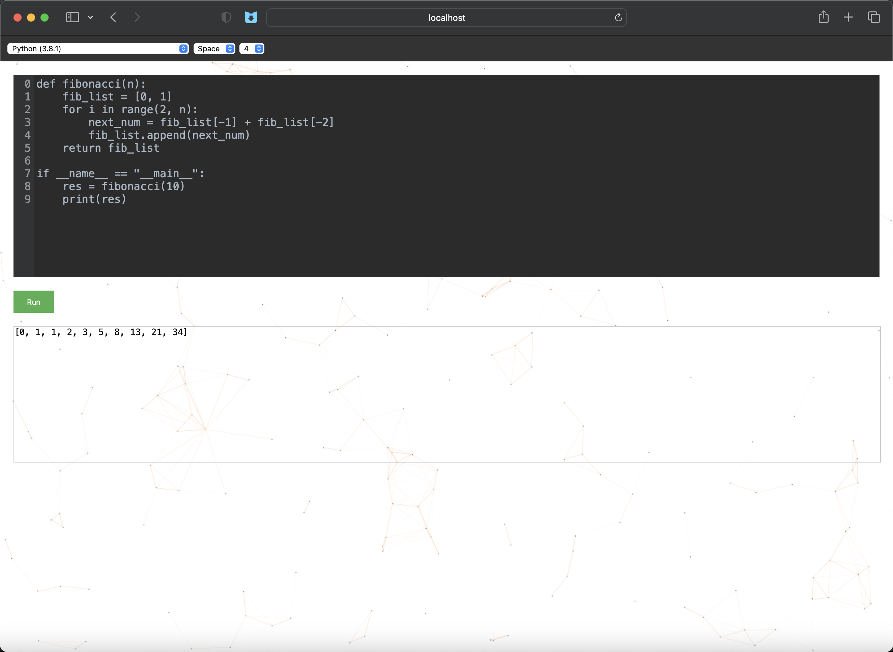

*[English](README-EN.md) ∙ [简体中文](README.md)*

[](https://github.com/<USERNAME>/<REPO_NAME>/graphs/contributors)

 
 


# 目录
* [项目简介](#项目简介)
* [快速开始](#快速开始)
* [使用说明](#使用说明)
* [项目目录结构](#项目目录结构)
* [作者](#作者)
* [贡献](#贡献)
* [更新日志及计划](#更新日志及计划)
* [特别鸣谢](#特别鸣谢)
* [开源协议](#开源协议)

## 项目简介
一个Geek风的大杂烩网站

## 快速开始
Step 1: 将项目代码克隆到本地

    git clone https://github.com/N0V1C3-R/GeekHomepage.git

Step 2: 进入项目目录

    cd /GeekHome

Step 3: 在/config/.env文件中配置相应取消注释并设置环境变量

Step 4: 修改docker-compose.yml文件中的变量配置
+ 如果系统架构为ARM架构，MYSQL_IMAGE=arm64v8/mysql:8.0
+ 如果系统架构为x86架构，MYSQL_IMAGE=mysql:8.0

Step 5: 使用docker-compose命令搭建项目

    docker-compose build
    docker-compose up

Step 6: 点击[注册](http://localhost:5466/register "link")一个用户开始使用

## 使用说明
+ 命令服务说明
>
> `help` 查看所有命令帮助
> 
> `man <COMMAND>` 查看指定命令详细说明
> 
> `clear` 清屏
> 
> `trans [-t TARGET_LANG] <TEXT>` 翻译命令，-t为可选项，用于指定目标语言，源语言自动检测，目标语言默认*英语（美式）*
> 
> `fx [-s SOURCE_CURRENCY] [-t TARGET_CURRENCY] <AMOUNT>` 汇率转化命令,-s和-t为可选项，分别用于指定源货币和目标货币，默认值分别为CNY和USD，数据来源 *[中国外汇交易中心](https://www.chinamoney.com.cn/ "link")*
>
> `morse <TEXT>` 摩斯电码编码命令
> 
> `esrom <TEXT>` 摩斯电码解码命令
> 
> `b64 [-d | -e] <TEXT>` Base64编码解码命令，使用-d参数为对文本进行Base64解码，使用-e为文本进行Base64编码，默认情况为Base64编码
> 
> `bc [-s SOURCE_BASE] [-t TARGET_BASE] <NUM>` 进制转化命令，-s和-t分别用于指定源进制和目标进制，源进制默认值为十进制和目标进制默认值为二进制
> 
> `tts [--ms] [--tz TIMEZONE] [TIME]` 时间转时间戳命令，--ms指定时间转化精度为毫秒级，默认为秒级，--tz参数指定时区
> 
> `tst [--ms] [--tz TIMEZONE] [TIMESTAMP]` 时间戳转时间命令，--ms指定时间转化精度为毫秒级，默认为秒级，--tz参数指定时区
> 
> `genpwd [-luns] [PWD_LENGTH]` 生成随机密码命令，l、u、n、s分别用于指定生成随机密码是否包含小写字母、大写字母、数字、特殊字符，PWD_LENGTH用于指定密码长度
>
> `codev [LANG] [-t | -s] [INDENT_UNIT]` 进入codev在线IDE页面命令，LANG指定开发语言（默认为Python3），-t和-s用于指定缩进类型（默认为Space缩进），INDENT_UNIT用于指定缩进长度（默认缩进4个字符）
> 
> `rename <NEW_USERNAME>` 修改用户名，默认用户名为创建时使用的邮箱地址（登录状态下使用）
> 
> `adk <SERVICE_NAME> <API_KEY>` 为服务添加私有的API Key（登录状态下使用）
> 
> `fdk <SERCICE_NAME>` 查找某一服务设置的私有API Key（登录状态下使用）
> 
> `upk <SERVICE_NAME>` 更新某一服务设置的私有API Key（登录状态下使用）
> 
> `ban <SERVICE_NAME>` 禁用某一服务的私有API Key（登录状态下使用）
> 
> `chmod <EMAIL> <MOD>` 修改用户权限（管理员功能）
> 
> `cd [PATH]` 切换收藏目录（登录状态下使用）
> 
> `ls [-l] [PATH]` 展示收藏目录下内容
> 
> `pwd` 查看当前收藏目录路径
> 
> `mkdir [PATH]` 创建收藏夹
> 
> `rm <PATH>` 删除收藏夹或收藏内容
> 
> `like <NAME> <URL>` 收藏网页或内容
> 
> `mv <-fnp> <OLD_NAME> <NEW_NAME>` 用于移动收藏夹或更新收藏记录
> 
> `open [-r | -n] <URL>` 打开某一链接命令，-r和-n分别为在当前标签页跳转和新标签页打开，默认为新标签页打开 
> 
> `login` 跳转登录页面命令
>
> `register` 跳转注册页面命令
> 
> `exit` 退出命令，登录状态下使用退出登录状态，未登录状态下使用关闭该窗口
> 
> `google [CONTENT]` Google搜索命令，不携带CONTENT参数会在新标签页打开 *[Google](https://www.google.com/ "link")* ，携带CONTENT会直接使用Google进行内容搜索并在新标签页打开（建议在支持使用Google的网络环境下使用该命令）
> 
> `bing [CONTENT]` Bing搜索命令，在不携带CONTENT参数的时候使用该命令会在新标签页打开 *[Bing](https://www.bing.com/ "link")* ，携带CONTENT会直接使用Bing进行内容搜索并在新标签页打开
> 
> `github [CONTENT]` GitHub搜索命令，在不携带CONTENT参数的时候使用该命令会在新标签页打开 *[GitHub](https://github.com/ "link")* ，携带CONTENT会直接使用GitHub进行内容搜索并在新标签页打开
>
> `blog [-a AUTHOR] [-t TITLE]` 进入博客列表页面，携带参数-a、-t分别用于搜索特定用户和带有关键词的标题
> 
> 
> 

+ 博客功能说明

**注意**：**请勿发表任何涉及到政治、非法、敏感的话题**
>
> 支持Markdown语法编写，支持修改已发布文章，支持匿名发布
>
> 
>

+ CodeV功能说明
>
> 一个在线代码编辑和执行功能，由 *[Judge0](https://judge0.com/ "link")* 提供开源API支持，适用于临时灵感实现、临时代码编辑需求
>
> 
> 

## 项目目录结构
```
.
├── Dockerfile
├── README-en.md
├── README.md
├── config --------------------------- // 项目配置文件夹，搭建服务时请修改.env配置文件
├── docker-compose.yml
├── go.mod
├── go.sum
├── init.sql
├── help.json ------------------------ // 命令帮助说明
└── src ------------------------------ // 项目源码目录
    ├── crontab_job ------------------ // 定时脚本任务目录，在该目录下编辑定时脚本
    ├── database --------------------- // MySQL服务有关代码目录
    │        ├── dao ----------------- // DAO层代码目录，每一个dao对应一个model，用于封装数据库操作代码
    │        └── model --------------- // Model模型目录，每一个model模型对应一个数据表
    ├── main
    │    └── main.go ----------------- // 主函数入口
    ├── redis ------------------------ // Redis服务有关代码目录
    ├── server ----------------------- // 服务接口代码目录
    │      ├── command_server -------- // 命令服务代码目录
    │      └── middleware ------------ // 中间件代码目录
    ├── templates -------------------- // 前端代码目录
    │         ├── css ---------------- // css文件目录
    │         ├── fonts -------------- // 字体文件目录
    │         ├── html --------------- // HTML文件目录
    │         ├── js ----------------- // JavaScript文件目录
    │         └── lib ---------------- // 第三方前端代码目录
    │             ├── codemirror
    │             └── editormd
    └── utils ------------------------ // 工具单元代码目录
```

## 作者

GeekHome项目由 *[Max Lee](https://github.com/N0V1C3-R)* 创建和维护

## 贡献

加入该项目开发可以从master分支切出一条新的开发分支进行开发，代码文件位置请看目录结构说明，当新功能开发完成可以发起一个PR到release-test分支，作者测试通过后将新功能合并到master分支进行项目部署及发布（请遵循commit规范）

## 更新日志及计划

你可以在 *[更新日志及计划](CHANGELOG.md)* 中查看项目更新情况及更新计划

## 特别鸣谢
项目灵感来源于 *[YuIndex](https://github.com/liyupi/yuindex)* 

感谢 *[DeepL](https://www.deepl.com/ "link")* 提供翻译API支持，感谢 *[Judge0](https://judge0.com/ "link")* 提供开源在线IDE功能支持

## 开源协议
